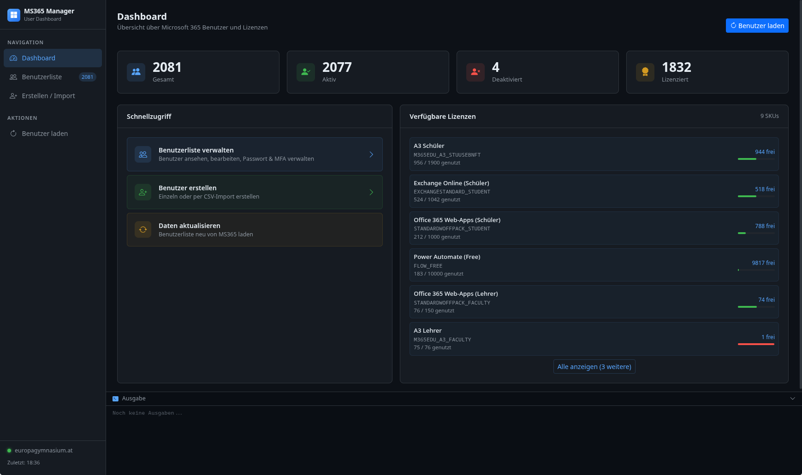

# MS-365 Passwort-Update Tool

Eine Electron-App zum Massen-Update von Microsoft 365/Entra ID (Azure AD) Benutzerpasswörtern über die Microsoft Graph API.

## Übersicht

Dieses Tool ermöglicht es Administratoren, Passwörter für mehrere Microsoft 365-Benutzer gleichzeitig zu setzen. Die App verwendet die Microsoft Graph PowerShell SDK und bietet eine benutzerfreundliche GUI für den Prozess.

## Features

- **CSV-basierte Massenaktualisierung**: Importiere CSV-Dateien mit Benutzerdaten
- **Integrierter CSV-Editor**: Bearbeite Benutzerdaten direkt in der App
- **Microsoft Graph Integration**: Nutzt die offizielle Microsoft Graph API
- **Linux-Unterstützung**: Funktioniert mit PowerShell Core auf Linux
- **Echtzeit-Logging**: Sieh alle Vorgänge in Echtzeit
- **Fehlerbehandlung**: Zeigt fehlgeschlagene Benutzer an

## Voraussetzungen

- **Node.js** und **npm** (für die Entwicklung)
- **PowerShell Core** (`pwsh`) oder **PowerShell** (auf Linux installiert)
  - Auf Arch Linux: `yay -S powershell-bin` oder `paru -S powershell-bin`
  - Alternativ: Installiere PowerShell Core über [Microsoft Docs](https://learn.microsoft.com/powershell/scripting/install/installing-powershell-on-linux)
- **Microsoft Graph-Berechtigungen**: Ein Microsoft 365-Konto mit `User.ReadWrite.All` Berechtigung
- **Microsoft.Graph.Users Modul**: Wird automatisch beim ersten Start installiert

## CSV-Format

Die CSV-Datei muss folgendes Format haben (Semikolon- oder Komma-getrennt):

```csv
UserPrincipalName;NewPassword;ForceChange
demo@example.com;NeuesPasswort123!;1
user2@example.com;AnderesPW456!;0
```

- **UserPrincipalName**: Die E-Mail-Adresse oder UPN des Benutzers
- **NewPassword**: Das neue Passwort
- **ForceChange**: `1` = Benutzer muss Passwort bei nächster Anmeldung ändern, `0` = nicht erforderlich

## Installation

1. **Repository klonen** oder herunterladen:
   ```bash
   git clone git@github.com:valueerrorx/Microsoft365-Users.git
   cd Microsoft365-Users
   ```

2. **Abhängigkeiten installieren**:
   ```bash
   npm install
   ```

3. **App starten**:
   ```bash
   npm run dev
   ```

## Verwendung

### 1. CSV-Datei importieren

- Klicke auf **"CSV importieren"**
- Wähle eine CSV-Datei im oben beschriebenen Format aus
- Die Anzahl der importierten Einträge wird angezeigt

### 2. Einträge bearbeiten (optional)

- Klicke auf **"Einträge bearbeiten"** um den integrierten CSV-Editor zu öffnen
- Füge, bearbeite oder entferne Benutzereinträge
- Änderungen werden automatisch gespeichert

### 3. Passwörter setzen

- Klicke auf **"Passwörter setzen (PowerShell)"**
- Bei der ersten Ausführung wird die Microsoft Graph-Anmeldung durchgeführt:
  - Ein Browser-Fenster öffnet sich automatisch
  - Melde dich mit deinem Microsoft 365 Admin-Konto an
  - Gewähre die erforderlichen Berechtigungen
- Der Fortschritt wird in Echtzeit angezeigt
- Bei Erfolg erscheint: "Alle Benutzer erfolgreich aktualisiert"
- Bei Fehlern werden die betroffenen Benutzer in einer Liste angezeigt

### 4. Logs anzeigen

- Klicke auf das Info-Icon (unten rechts) um das detaillierte Log zu öffnen
- Alle Vorgänge werden mit Zeitstempel angezeigt

## Technische Details

### Architektur

```
Electron Main Process (index.js)
├── CSV Import & Editor
├── PowerShell Process Spawn
│   └── update-user-passwords.ps1
│       ├── Microsoft Graph Authentication
│       └── Batch Password Updates
└── UI Communication (IPC)
```

### Workflow

1. **CSV-Import**: Datei wird geladen und geparst
2. **Temporäre CSV**: Daten werden in eine temporäre CSV-Datei geschrieben
3. **PowerShell-Skript**: Wird mit dem CSV-Pfad als Parameter gestartet
4. **Graph-Authentifizierung**: `Connect-MgGraph` stellt die Verbindung her
5. **Passwort-Updates**: Für jeden Benutzer wird `Update-MgUser` aufgerufen
6. **Fehlerbehandlung**: Fehlgeschlagene Updates werden erfasst und angezeigt
7. **Aufräumen**: Temporäre Dateien werden gelöscht

### Dateien

- `index.js`: Electron Main Process mit CSV-Handling und PowerShell-Integration
- `index.html`: Benutzeroberfläche
- `editor.html`: CSV-Editor Fenster
- `preload.js`: IPC-Brücke für sichere Kommunikation
- `update-user-passwords.ps1`: PowerShell-Skript für Microsoft Graph API-Aufrufe

## Build

Erstelle eine AppImage für Linux:

```bash
npm run build
```

Die AppImage wird im `dist/` Verzeichnis erstellt.

## PowerShell-Kompatibilität

Die App erkennt automatisch, ob `pwsh` (PowerShell Core) oder `powershell` installiert ist und verwendet entsprechend den verfügbaren Befehl.

### Manuelle Ausführung des PowerShell-Skripts

Falls du das Skript manuell testen möchtest:

```bash
pwsh -NoLogo -NoProfile -ExecutionPolicy Bypass \
  -File update-user-passwords.ps1 \
  -CSVPath /pfad/zur/user-passwords.csv
```

## Fehlerbehebung

### "CSV-Pfad ungültig"
- Stelle sicher, dass die CSV-Datei existiert und lesbar ist
- Prüfe, ob der Pfad Leerzeichen enthält (sollte funktionieren, aber prüfe die Logs)

### "PowerShell mit Fehlern beendet"
- Prüfe die Logs für detaillierte Fehlermeldungen
- Stelle sicher, dass PowerShell mit `Microsoft.Graph.Users` Modul installiert ist
- Prüfe die Berechtigungen deines Microsoft 365-Kontos

### Authentifizierungsprobleme
- Beim ersten Start wird ein Browser-Fenster zur Anmeldung geöffnet
- Stelle sicher, dass du dich mit einem Konto anmeldest, das `User.ReadWrite.All` Berechtigung hat
- Die Authentifizierung wird für spätere Ausführungen gespeichert

### ANSI-Escape-Codes in den Logs
- Die App filtert automatisch ANSI-Farbcodes aus den Logs
- Falls dennoch Codes erscheinen, melde einen Bug

## Sicherheit

- **Passwörter**: Werden nur während der Verarbeitung im Speicher gehalten
- **Temporäre Dateien**: CSV-Dateien werden im System-Temp-Verzeichnis erstellt und nach Abschluss gelöscht
- **Authentifizierung**: Verwendet OAuth 2.0 mit Microsoft Graph (delegated access)
- **Lokale Speicherung**: Keine Passwörter werden dauerhaft gespeichert

## Lizenz

ISC

## Autor

valueerror


