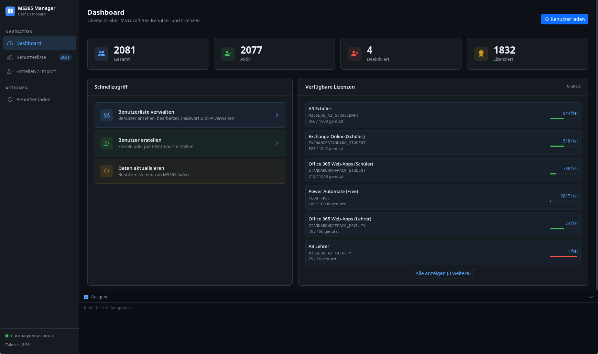

# MS-365 Benutzer-Verwaltungs Tool

Eine Electron-App zum Erstellen und Aktualisieren von Microsoft 365/Entra ID (Azure AD) Benutzern über die Microsoft Graph API.

## Übersicht

Dieses Tool ermöglicht es Administratoren, neue Benutzer in Microsoft 365 zu erstellen oder bestehende Benutzer zu aktualisieren. Neue Benutzer erhalten automatisch MS A3 Lizenzen (Schüler oder Lehrer). Die App verwendet die Microsoft Graph PowerShell SDK und bietet eine benutzerfreundliche GUI für den Prozess.

## Features

- **CSV-basierte Benutzer-Verwaltung**: Importiere CSV-Dateien mit Benutzerdaten
- **Automatische Benutzer-Erstellung**: Neue Benutzer werden automatisch erstellt, wenn sie nicht existieren
- **Lizenzzuweisung**: Automatische Zuweisung von MS A3 Lizenzen (Schüler/Lehrer)
- **Automatische UPN-Generierung**: UserPrincipalName wird aus Vorname/Nachname generiert
- **Integrierter CSV-Editor**: Bearbeite Benutzerdaten direkt in der App
- **Microsoft Graph Integration**: Nutzt die offizielle Microsoft Graph API
- **Linux-Unterstützung**: Funktioniert mit PowerShell Core auf Linux
- **Echtzeit-Logging**: Sieh alle Vorgänge in Echtzeit
- **Fehlerbehandlung**: Zeigt fehlgeschlagene Benutzer an

## Voraussetzungen

- **Node.js** und **npm** (für die Entwicklung)
- **PowerShell Core** (`pwsh`) oder **PowerShell** (auf Linux installiert)
  - Auf Arch Linux: `yay -S powershell-bin` oder `paru -S powershell-bin`
  - Alternativ: Installiere PowerShell Core über [Microsoft Docs](https://learn.microsoft.com/powershell/scripting/install/installing-powershell-on-linux)
- **Microsoft Graph-Berechtigungen**: Ein Microsoft 365-Konto mit `User.ReadWrite.All` Berechtigung
- **Microsoft.Graph.Users Modul**: Wird automatisch beim ersten Start installiert
- **Microsoft.Graph.Identity.DirectoryManagement Modul**: Wird automatisch installiert (für Lizenzzuweisung)

## CSV-Format

Die CSV-Datei muss folgendes Format haben (Semikolon- oder Komma-getrennt):

```csv
Vorname;Nachname;Abteilung;UserType;NewPassword;ForceChange
Max;Mustermann;2024;Schüler;Passwort123!;1
Anna;Schmidt;2024;Lehrer;Passwort456!;0
```

**Felder:**
- **Vorname**: Der Vorname des Benutzers (erforderlich)
- **Nachname**: Der Nachname des Benutzers (erforderlich)
- **Abteilung**: Die Abteilung (z.B. Erstellungsjahr) - optional
- **UserType**: "Schüler" oder "Lehrer" (bestimmt die zugewiesene Lizenz) - Standard: "Schüler"
- **NewPassword**: Das Passwort für den Benutzer (erforderlich)
- **ForceChange**: `1` = Benutzer muss Passwort bei nächster Anmeldung ändern, `0` = nicht erforderlich

**Automatisch generiert:**
- **UserPrincipalName**: Wird automatisch als `nachname.vorname@{tenant-domain}` generiert
- **DisplayName**: Wird automatisch als "Nachname Vorname" generiert

**Verhalten:**
- Wenn ein Benutzer mit dem generierten UserPrincipalName bereits existiert: Nur das Passwort wird aktualisiert
- Wenn ein Benutzer nicht existiert: Neuer Benutzer wird erstellt mit allen Feldern und erhält die entsprechende Lizenz (Schüler oder Lehrer)

## Installation

1. **Repository klonen** oder herunterladen:
   ```bash
   git clone git@github.com:valueerrorx/Microsoft365-Users.git
   cd Microsoft365-Users
   ```

2. **Abhängigkeiten installieren**:
   ```bash
   npm install
   ```

3. **App starten**:
   ```bash
   npm run dev
   ```

## Verwendung

### 1. Verbindung herstellen / Benutzer laden

- Öffne **Dashboard** und klicke auf **"Benutzer laden"**
- Beim ersten Start öffnet sich ein Browser-Fenster zur Microsoft-Graph-Anmeldung
- Danach werden Benutzerliste und Lizenz-SKUs geladen

### 2. Benutzer verwalten (Einzeloperationen)

- Öffne **"Benutzerliste"** (`/users`)
- Dort kannst du:
  - Benutzer bearbeiten (z.B. DisplayName, Abteilung, Jobtitel, UsageLocation, aktiv/deaktiviert)
  - Passwort zurücksetzen
  - MFA/2FA zurücksetzen

### 3. Benutzer erstellen / importieren (Bulk)

- Öffne **"Erstellen / Import"** (`/create`)
- **Einzeln**: Benutzer ausfüllen → **"Zur Liste hinzufügen"**
- **CSV Import**: CSV auswählen → Einträge werden in einer Tabelle angezeigt und können direkt angepasst werden
- Danach **"Benutzer erstellen / aktualisieren"** starten

### 4. Logs anzeigen

- Unten gibt es eine **Ausgabe-Konsole** (klappbar), die PowerShell/Graph Logs live anzeigt
- Toasts (rechts unten) zeigen Erfolg/Fehler kurz an

## Technische Details

### Architektur

```
Renderer (Vue + Vite)
└── window.ipcRenderer.invoke(...)
    ↓
Electron Main Process (index.js)
├── IPC Handler (get-users, update-user, reset-password, reset-mfa, bulk)
├── CSV Parsing + Temp CSV (os.tmpdir)
└── PowerShell Spawn (pwsh/powershell) → scripts/*.ps1
    ↓
Microsoft Graph PowerShell SDK (Connect-MgGraph, Get/Update/New user, Assign license, Auth methods)
```

### Workflow

**Benutzerliste laden**
1. Renderer ruft `get-users` per IPC auf
2. Main startet `scripts/get-ms365-users.ps1`
3. PowerShell verbindet sich mit Graph (`Connect-MgGraph`) und gibt JSON zurück (`###JSON_START/END###`)
4. Renderer zeigt Users/Lizenzen an

**Bulk Create/Update (CSV)**
1. CSV wird im Main Process geparst und normalisiert
2. Einträge werden als temporäre CSV ins System-Temp geschrieben
3. Main startet `scripts/update-user-passwords.ps1 -CSVPath <tmp>`
4. Script ermittelt Tenant-Domain, SKUs (A3 Schüler/Lehrer) und verarbeitet jede Zeile:
   - existiert User? → Passwort aktualisieren
   - sonst → User anlegen + UsageLocation setzen + Lizenz zuweisen
5. Logs werden live an die UI gestreamt, Temp-Dateien werden gelöscht

### Dateien

- `index.js`: Electron Main Process mit CSV-Handling und PowerShell-Integration
- `index.html`: Renderer-Entry (Vite) → `src/main.js`
- `preload.js`: IPC-Brücke für sichere Kommunikation
- `scripts/get-ms365-users.ps1`: Benutzer + Lizenzen laden (JSON Output)
- `scripts/update-user.ps1`: Benutzerattribute aktualisieren (JSON Output)
- `scripts/reset-password.ps1`: Passwort zurücksetzen (JSON Output)
- `scripts/reset-mfa.ps1`: MFA/2FA Methoden entfernen (JSON Output)
- `scripts/update-user-passwords.ps1`: Bulk Create/Update aus CSV + Lizenzzuweisung (Log streaming)

## Build

Erstelle eine AppImage für Linux:

```bash
npm run build
```

Die AppImage wird im `dist/` Verzeichnis erstellt.

## PowerShell-Kompatibilität

Die App erkennt automatisch, ob `pwsh` (PowerShell Core) oder `powershell` installiert ist und verwendet entsprechend den verfügbaren Befehl.

### Manuelle Ausführung des PowerShell-Skripts

Falls du das Skript manuell testen möchtest:

```bash
pwsh -NoLogo -NoProfile -ExecutionPolicy Bypass \
  -File scripts/update-user-passwords.ps1 \
  -CSVPath /pfad/zur/user-passwords.csv
```

## Fehlerbehebung

### "CSV-Pfad ungültig"
- Stelle sicher, dass die CSV-Datei existiert und lesbar ist
- Prüfe, ob der Pfad Leerzeichen enthält (sollte funktionieren, aber prüfe die Logs)

### "PowerShell mit Fehlern beendet"
- Prüfe die Logs für detaillierte Fehlermeldungen
- Stelle sicher, dass PowerShell mit `Microsoft.Graph.Users` und `Microsoft.Graph.Identity.DirectoryManagement` Modulen installiert ist
- Prüfe die Berechtigungen deines Microsoft 365-Kontos (je nach Aktion z.B. `User.ReadWrite.All`, `Organization.Read.All`, `UserAuthenticationMethod.ReadWrite.All`)
- Stelle sicher, dass A3-Lizenzen im Tenant verfügbar sind

### Authentifizierungsprobleme
- Beim ersten Start wird ein Browser-Fenster zur Anmeldung geöffnet
- Stelle sicher, dass du dich mit einem Konto anmeldest, das die jeweils benötigten Scopes hat (z.B. `User.ReadWrite.All`, `Organization.Read.All`, `Directory.Read.All`)
- Die Authentifizierung wird für spätere Ausführungen gespeichert

### Lizenzzuweisung funktioniert nicht
- Prüfe, ob A3-Lizenzen im Tenant verfügbar sind
- Stelle sicher, dass genügend Lizenzen vorhanden sind
- Prüfe die Logs für detaillierte Fehlermeldungen zur Lizenzzuweisung

### ANSI-Escape-Codes in den Logs
- Die App filtert automatisch ANSI-Farbcodes aus den Logs
- Falls dennoch Codes erscheinen, melde einen Bug

## Sicherheit

- **Passwörter**: Werden nur während der Verarbeitung im Speicher gehalten
- **Temporäre Dateien**: CSV-Dateien werden im System-Temp-Verzeichnis erstellt und nach Abschluss gelöscht
- **Authentifizierung**: Verwendet OAuth 2.0 mit Microsoft Graph (delegated access)
- **Lokale Speicherung**: Keine Passwörter werden dauerhaft gespeichert

## Lizenz

ISC

## Autor

valueerror


