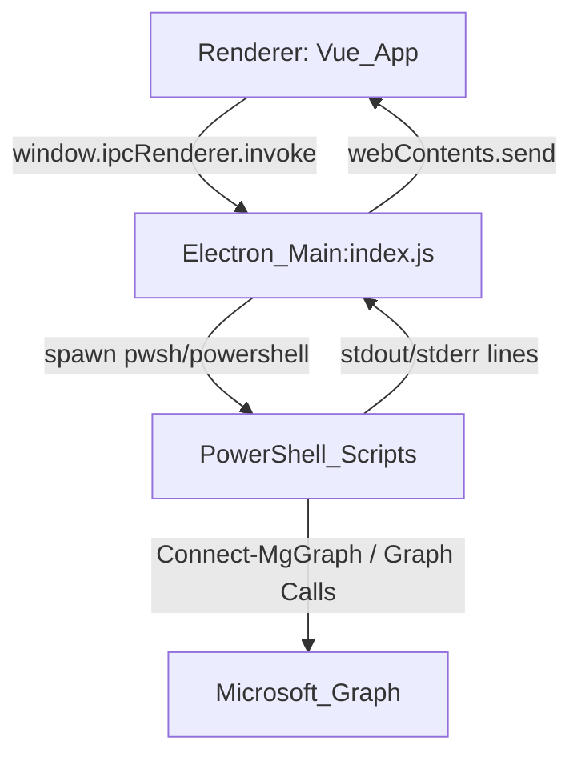

# Project: MS-365 User Management Dashboard (Electron + Vue + PowerShell/Graph)

## Ziel & Zweck
- **Zweck**: Desktop-App für Admins zum **Listen/Ändern** von Microsoft 365 / Entra ID (Azure AD) Benutzern sowie **Massen-Erstellung/Update** aus CSV, inkl. **Lizenzzuweisung (A3 Schüler/Lehrer)**, **Passwort-Reset** und **MFA-Reset**.
- **Technik-Ansatz**: UI (Vue) ↔ IPC ↔ Electron Main Process ↔ `pwsh`/PowerShell ↔ Microsoft Graph PowerShell SDK.

## Tech-Stack (aus `package.json`)
- **Renderer/UI**: Vue 3 + Vue Router + Pinia, Bootstrap 5 + Bootstrap Icons, Vite 5
- **Desktop Shell**: Electron (Main Process in `index.js`, Preload in `preload.js`)
- **“Backend”**: PowerShell-Skripte in `scripts/*.ps1` (Microsoft Graph SDK)
- **Build**: Vite build in `dist/`, Packaging via `electron-builder`

## Projektstruktur (High-Level)
```
.
├─ index.js                # Electron Main Process: Fenster, IPC, CSV, spawn PowerShell
├─ preload.js              # IPC Bridge: expose invoke/on/sendSync in Renderer
├─ index.html              # Renderer-Entry (Vite) -> /src/main.js
├─ editor.html             # Separates Fenster: CSV-Editor (Plain HTML/JS + Bootstrap)
├─ vite.config.js          # Vite config (base './', alias '@' -> /src)
├─ scripts/                # PowerShell: Graph-Operationen (JSON-marked stdout)
│  ├─ get-ms365-users.ps1
│  ├─ update-user.ps1
│  ├─ reset-password.ps1
│  ├─ reset-mfa.ps1
│  └─ update-user-passwords.ps1
└─ src/
   ├─ main.js              # Vue bootstrap + CSS + router + pinia mount
   ├─ App.vue              # Layout + global IPC event listeners -> Stores/Logs
   ├─ router/index.js      # Routen: dashboard/users/create (HashHistory)
   ├─ stores/
   │  ├─ authStore.js      # Connection state + logs + toast notifications
   │  └─ usersStore.js     # Users/licenses + CSV state + bulk ops (IPC invoke)
   ├─ views/
   │  ├─ DashboardView.vue # Stats + Lizenzübersicht + Quick actions
   │  ├─ UsersView.vue     # Table + Filter/Sort + Modals (edit/pw/mfa/toggle)
   │  └─ CreateUsersView.vue # Single + CSV Import/Preview + Bulk run
   ├─ components/
   │  ├─ AppSidebar.vue    # Navigation + connection status + refresh
   │  ├─ LogConsole.vue    # Bottom console, live logs, autoscroll
   │  └─ PasswordInput.vue # PW strength/requirements, uses passwordValidator
   └─ utils/passwordValidator.js # Password policy helper (MS complexity)
```

## Architektur & Datenfluss


### Renderer ↔ Main (IPC)
- **Renderer API**: `window.ipcRenderer` kommt aus `preload.js` (contextBridge).
- **Renderer → Main (invoke)**:
  - `get-users` → `scripts/get-ms365-users.ps1` (liefert Users + Licenses + tenantDomain als JSON)
  - `update-user` → `scripts/update-user.ps1` (update properties)
  - `reset-password` → `scripts/reset-password.ps1`
  - `reset-mfa` → `scripts/reset-mfa.ps1`
  - `open-csv-dialog` / `get-csv-data` / `set-csv-data` → CSV Handling im Main
  - `run-password-update` → Bulk CSV → `scripts/update-user-passwords.ps1` (line-by-line logs)
- **Main → Renderer (send events)**:
  - `ps-operation-log` (log objects `{type,message}` aus `runPsScript` callbacks)
  - `ps-operation-complete` (status summary)
  - `pwsh-log` (Bulk stdout/stderr line-by-line)
  - `pwsh-complete` (bulk finished + exit code + `failedUsers`)

### JSON-Rückgaben aus PowerShell
- Mehrere Scripts umschließen JSON mit Markern:
  - `###JSON_START###` … JSON … `###JSON_END###`
- `index.js` parsed JSON über `parseJsonFromOutput(stdout)`.

## Verantwortlichkeiten: zentrale Dateien

### Electron Main Process
- **`index.js`**
  - Window lifecycle (Single instance lock, load Vite dev server oder `dist/index.html`)
  - IPC handler für:
    - Benutzerliste laden / Passwort reset / MFA reset / User update (jeweils PowerShell)
    - CSV Import, Parsing, Normalisierung, Speicherung im Main process
    - Bulk: CSV in Temp schreiben, PowerShell spawn, Logs streamen, `failedUsers` extrahieren
  - PowerShell detection: `which pwsh`, `where.exe pwsh`, `which powershell`
  - Script copy-to-temp: `getScriptPath` kopiert `.ps1` in `os.tmpdir()` (für Packaging/Readonly paths)

- **`preload.js`**
  - Exposed API: `invoke`, `on`, `sendSync`
  - Wichtig: Renderer nutzt `window.ipcRenderer.invoke(...)` überall.

### Renderer (Vue)
- **`src/main.js`**: Vue app init + Bootstrap + CSS.
- **`src/App.vue`**:
  - Global listeners für `ps-operation-log`, `ps-operation-complete`, `pwsh-log`, `pwsh-complete`
  - Pusht Logs in `authStore.logs` und bulk logs in `usersStore.bulkLogs`
  - Toast UI (aus `authStore.toasts`)
- **`src/router/index.js`**: Hash routes `/`, `/users`, `/create`
- **`src/stores/authStore.js`**:
  - `connected`, `tenantDomain`, logs + toasts
  - `addLog()` setzt `timestamp` (de-AT)
- **`src/stores/usersStore.js`**:
  - `fetchUsers()` ruft `get-users` auf, setzt users/licenses, setzt `authStore.setConnected(tenantDomain)`
  - `resetPassword()`, `resetMfa()`, `updateUser()` → jeweils IPC
  - CSV: `importCsv()` nutzt `open-csv-dialog` + `get-csv-data`
  - Bulk: `runBulkCreate()` syncs CSV via `set-csv-data` und startet `run-password-update`

### Views / Components (UI)
- **`src/views/DashboardView.vue`**: Übersicht, Stats, Lizenzprogress.
- **`src/views/UsersView.vue`**: Tabelle + Filter/Sort/Pagination + Modals:
  - Edit user → `usersStore.updateUser`
  - Reset password → `usersStore.resetPassword`
  - Reset MFA → `usersStore.resetMfa`
  - Toggle enabled/disabled → `usersStore.updateUser({ accountEnabled: ... })`
- **`src/views/CreateUsersView.vue`**:
  - Single entry hinzufügen → landet in `usersStore.csvEntries`
  - CSV Import tab → `usersStore.importCsv()`
  - Bulk run → `usersStore.runBulkCreate()`
  - Berechnet UPN preview im Renderer aus `authStore.tenantDomain`
- **`src/components/PasswordInput.vue`**: UI for password complexity via `validatePassword()`.
- **`src/utils/passwordValidator.js`**: Passwort-Policy (min 8, 3/4 categories).
- **`src/assets/main.css`**: Dark theme + Layout + table/badges/toasts/log console styles.

## PowerShell Scripts: Aufgaben & Graph Permissions
Alle Skripte nutzen Microsoft Graph PowerShell SDK; bei Bedarf installieren sie Module im CurrentUser Scope.

### `scripts/get-ms365-users.ps1`
- **Zweck**: Users + Licenses + tenant default domain als JSON zurückgeben.
- **Graph scopes**: `"User.Read.All"`, `"Organization.Read.All"`, `"Directory.Read.All"`
- **Output JSON**: `{status, tenantDomain, users[], licenses[], count}`

### `scripts/update-user.ps1`
- **Zweck**: Benutzerattribute updaten (DisplayName, GivenName, Surname, Department, JobTitle, UsageLocation, AccountEnabled).
- **Graph scopes**: `"User.ReadWrite.All"`
- **Output JSON**: `{status, message, upn, user:{...}}`

### `scripts/reset-password.ps1`
- **Zweck**: Passwort setzen via `Update-MgUser -PasswordProfile`.
- **Graph scopes**: `"User.ReadWrite.All"`
- **Params**: `-UPN`, `-NewPassword`, optional `-ForceChange` ("1"/"true")
- **Output JSON**: `{status, message, upn}`

### `scripts/reset-mfa.ps1`
- **Zweck**: MFA/2FA Methoden entfernen (Authenticator, phone, email, software oath, fido2, TAP).
- **Graph scopes**: `"UserAuthenticationMethod.ReadWrite.All"`, `"User.Read.All"`
- **Output JSON**: `{status, message, upn, removedCount, errors[]}`

### `scripts/update-user-passwords.ps1` (Bulk CSV)
- **Zweck**: CSV verarbeiten: pro Zeile UPN generieren, User existiert? → create + license oder update password.
- **CSV Input**: `-CSVPath` (oder env `CSV_PATH`), liest UTF-8, erwartet semikolon-delimited.
- **Graph scopes**: `"User.ReadWrite.All"`, `"Organization.Read.All"`
- **UPN Format**: `nachname.vorname@{tenantDomain}` (mit Normalisierung)
- **Create path**:
  - `New-MgUser` mit `PasswordProfile` + optional Department
  - `Update-MgUser -UsageLocation "AT"` (Default)
  - Lizenz: ermittelt A3 Student/Faculty SKUs und weist zu (primär `Set-MgUserLicense`, fallback REST `assignLicense`)
- **Update path**: `Update-MgUser -PasswordProfile`
- **Logging**: schreibt viele `Write-Host` Zeilen; Main process streamt diese an UI (Bulk console).

## CSV / UPN Normalisierung: wichtige Stelle
Es gibt **mehrere Implementierungen** derselben Normalisierung:
- `index.js` (Main) `normalizeForUPN()`
- `scripts/update-user-passwords.ps1` `Normalize-ForUPN`
- `editor.html` JS `normalizeForUPN()`
- `src/views/CreateUsersView.vue` lokale `normalizeForUPN()`

Wenn du an UPN-Regeln etwas änderst, musst du **alle** Stellen konsistent halten (oder später zentralisieren).

## Dev/Build/Run
- **Dev**: `npm run dev` (startet Vite + Electron, Electron lädt `VITE_DEV_SERVER_URL`)
- **Build**: `npm run build:renderer` (Vite → `dist/`), danach `npm run build` (renderer + electron-builder)

## Security / Daten
- Passwörter: werden im UI erfasst und via IPC an Main übergeben; Bulk schreibt temporär CSV in `os.tmpdir()` (mit BOM) und löscht danach.
- Keine `.env` im Repo gesehen; Graph auth läuft delegated via `Connect-MgGraph` (Browser login beim ersten Mal).
- Logs können UPNs enthalten; Vorsicht bei Sharing.

## Wo Code ändern (typische Änderungen)
- **Neue Graph-Funktion**: neues `scripts/*.ps1` + neuer `ipcMain.handle(...)` in `index.js` + Store action in `src/stores/*` + UI in `src/views/*`.
- **UI/UX**: `src/views/*`, `src/components/*`, Styling in `src/assets/main.css`.
- **CSV Import/Parsing**: `index.js` `parseCsvText()` und `toSemicolonCsv()` + CSV editor `editor.html`.

## Nicht-Ziele / Out-of-scope (aktuell)
- Kein eigener Backend-Server; alles lokal via PowerShell + Graph.
- Kein persistenter DB-Speicher; CSV + live Graph.

